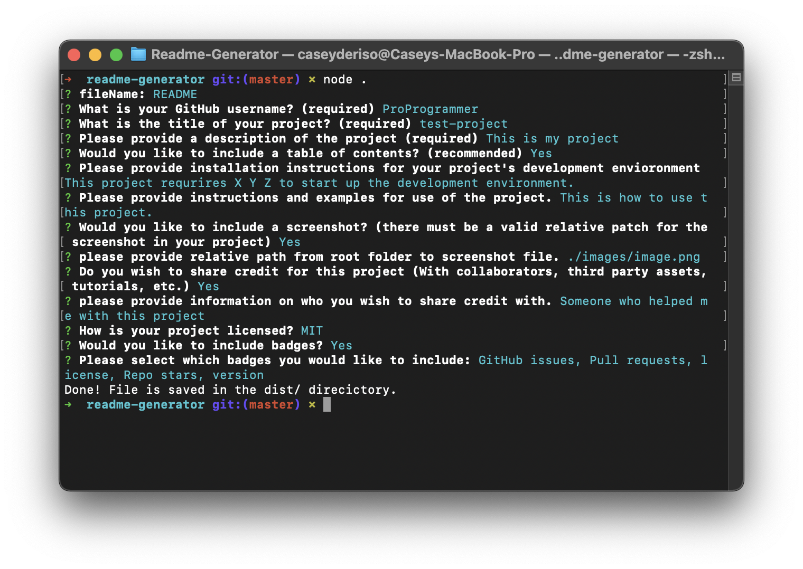

# Readme-Generator

   

## Description

This project will produce a professional README.md file for the user by taking input from command line prompts. A professional looking readme is the face of any project and deserves to be professional looking and consistent across projects. Readme-Generator seeks to streamline the proccess of creating a readme, which can be tedious. 

## Table of Contents:
* [Installation](#installation)
* [Usage](#usage)
* [Screenshot](#screenshot)
* [Credits](#credits)
* [License](#license)
* [Tutorial](#tutorial)

## Installation 

This project requires node.js to be installed on your local machine. After downloading the repository to your local machine, open the terminal and type the command 'npm install' to download the required dependencies. After that, type 'node .' or 'node index.js' and follow the command line prompts to generate your readme!

## Usage 

This project should be used as a tool to homogenize your readme's across all of your projects. Thanks to the template styling of this project, every readme you generate will share styling and layout, allowing you to spend more time developing, and less time worrying about if your readme is professional.    

## Screenshot

## Credits

UT Austin full stack web development bootcamp

## License 

Unlicense

## Tutorial

[Link to tutorial video](https://www.youtube.com/watch?v=_Mbjo42o7EU&feature=youtu.be)
